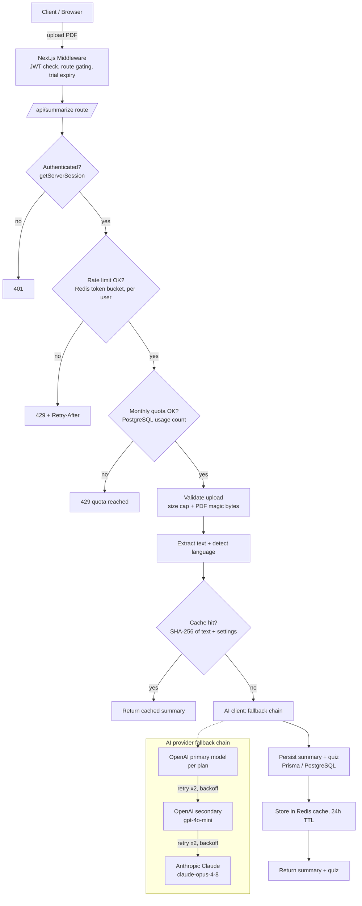
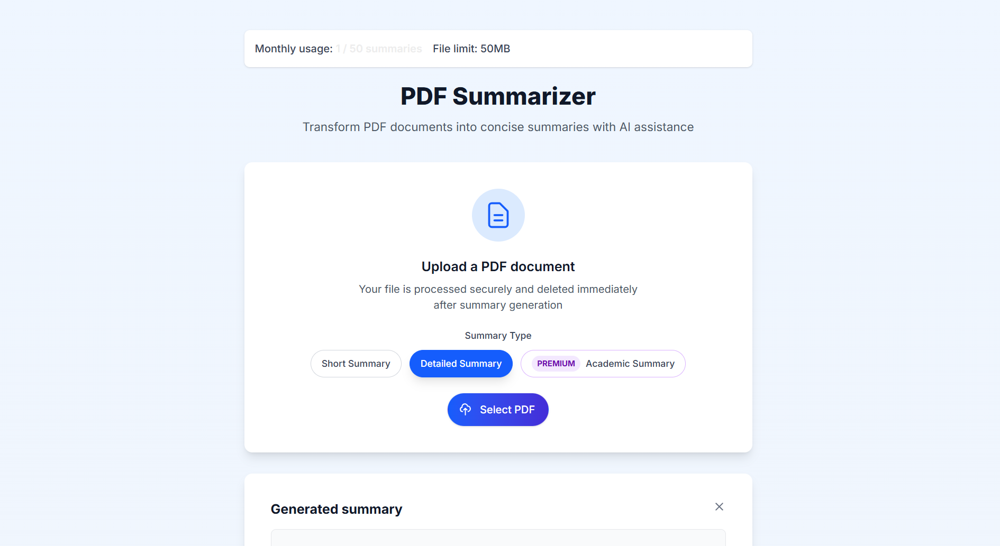

# SmartPDFNotes

Turn long PDFs into structured summaries, self-study quizzes, and printable cheat sheets - an AI study assistant built on Next.js with a multi-provider LLM pipeline.

**Live demo:** https://smartpdfnotes.com

---

## Overview

SmartPDFNotes is a full-stack SaaS that helps students digest long documents. A user uploads a PDF; the app extracts the text, detects its language, and generates a tiered summary (and, on paid plans, a multiple-choice quiz) through an OpenAI → Anthropic fallback chain. Summaries can be grouped into courses to produce a consolidated final summary, a course quiz, and a printable cheat sheet.

The application is built as a single Next.js codebase deployed to Vercel: React front end, serverless API routes, PostgreSQL via Prisma, Stripe billing, and Upstash Redis for distributed caching and rate limiting.

---

## Features

**Core**
- **AI PDF summarization** with a selectable length (short / long / academic) and model quality that scales with the user's plan.
- **Automatic quiz generation** - multiple-choice self-evaluation questions produced alongside the summary on paid tiers.
- **Courses** - group multiple summaries into a course, then generate a consolidated final summary, a course-wide quiz, and a printable A4 cheat sheet (formulas, definitions, and key terms extracted from the material).
- **Summary management** - browse, view, and download generated summaries as PDF.
- **Math rendering** - LaTeX/KaTeX support so formula-heavy material renders correctly.

**Free PDF utilities** (no account required)
- **Convert to PDF** - combine images (JPG, PNG), text files, and Word documents (`.docx`, rendered through headless Chromium) into a single PDF.
- **PDF translation** - extract a PDF's text, translate it, and rebuild the document.

**Platform**
- **Authentication** - email/password (bcrypt) and Google OAuth via NextAuth with JWT sessions.
- **Subscription billing** - Stripe Checkout with free / trial / standard / premium tiers, multi-currency pricing (USD / EUR / RON), monthly and annual plans, and a self-service customer portal.
- **Usage quotas & free trial** - per-plan monthly limits enforced server-side, plus a time-limited trial.
- **Internationalization** - UI in five languages (English, Romanian, German, Spanish, French) with automatic locale detection, and automatic content-language detection for summaries.
- **Analytics** - Google Analytics plus an internal event log for conversion tracking.
- **Transactional email** - password-reset codes delivered via Resend.

---

## Tech Stack

| Layer | Technology |
|-------|------------|
| **Frontend** | Next.js 15 (App Router), React 19, TypeScript, Tailwind CSS v4, next-intl, react-markdown (remark-gfm, rehype-raw, rehype-sanitize), KaTeX, react-dropzone |
| **Backend** | Next.js API routes (serverless functions), Prisma ORM |
| **Database** | PostgreSQL (Supabase-hosted), accessed via Prisma |
| **AI providers** | OpenAI (gpt-3.5-turbo, gpt-4o-mini) with Anthropic Claude (claude-opus-4-8) as fallback |
| **Caching & rate limiting** | Upstash Redis (`@upstash/redis`, `@upstash/ratelimit`) |
| **Auth** | NextAuth (Credentials + Google), JWT session strategy |
| **Payments** | Stripe (Checkout, Customer Portal, webhooks) |
| **Email** | Resend |
| **PDF processing** | pdf-parse, pdf-lib, mammoth, puppeteer-core + @sparticuz/chromium |
| **Deployment** | Vercel |

---

## Architecture

The system runs entirely as Next.js serverless functions. Because serverless instances don't share memory and are recycled between requests, all cross-request state - cache entries and rate-limit counters - lives in Upstash Redis rather than in-process, with a per-instance in-memory fallback for local development.

### Request flow (summary generation)



Billing is handled out of band: Stripe sends `checkout.session.completed` / `invoice.payment_succeeded` / `customer.subscription.*` events to a dedicated webhook route, which verifies the signature against `STRIPE_WEBHOOK_SECRET` and updates the user's subscription in PostgreSQL.

### AI fallback chain

Every LLM call goes through a single entry point (`app/lib/ai-client.ts`) that tries providers in order and only surfaces an error once all of them fail:

1. **Primary OpenAI model** - chosen by the user's plan (`gpt-3.5-turbo` for free/trial/standard, `gpt-4o-mini` for premium).
2. **Secondary OpenAI model** - `gpt-4o-mini`.
3. **Anthropic Claude** - `claude-opus-4-8`, attempted only when `ANTHROPIC_API_KEY` is configured.

Each hop retries transient failures (HTTP 429, 5xx, and network errors) twice with exponential backoff before advancing to the next provider.

### Caching

Summaries are cached in Redis under a content-addressed key: a SHA-256 hash of the full document text plus every setting that affects output (prompt version, plan, summary length, detected language). Hashing the entire document - not a prefix - prevents different documents that share a title page from colliding. Entries carry a 24-hour TTL, and a prompt-version prefix lets a deploy invalidate stale-format entries.

### Rate limiting

A shared token-bucket limiter (`app/lib/rate-limit.ts`) backs several named buckets, each tuned to its endpoint:

| Bucket | Keyed by | Purpose |
|--------|----------|---------|
| `ai` | user id | LLM endpoints (summarize, course quiz/summary, cheat sheet) |
| `auth` | IP | credential endpoints |
| `convert` | IP | unauthenticated PDF utilities |
| `reset` | IP **and** account | password-reset flow (per-account key caps guesses regardless of IP rotation) |

Token buckets allow a legitimate burst (a student uploading several chapters back to back) while capping sustained throughput. The limiter fails open on a Redis error, so a rate-limiter outage can never take the app down.

---

## Key Technical Decisions

**Why serverless (Next.js on Vercel).** A single deployable unit for both UI and API, automatic per-request scaling, and no server to operate. The main trade-off - no shared in-process state and cold starts that wipe memory - is what drove the move to Redis-backed caching and rate limiting. An earlier in-memory summary cache was effectively useless in production because each lambda instance had its own copy and lost it on every cold start.

**Why an AI provider fallback chain.** The core feature depends on a third-party LLM API, and those APIs return transient 429/5xx errors and have occasional outages. Relying on a single provider means the product's main function goes down with it. Chaining OpenAI → a cheaper OpenAI model → Anthropic Claude, with retry and backoff at each hop, keeps summaries flowing through rate-limit spikes and provider incidents. It also allows model quality to scale per plan without changing call sites.

**Why token-bucket rate limiting on top of monthly quotas.** Monthly quotas cap total usage but do nothing to stop a burst of automated requests from hammering the expensive LLM pipeline within a single billing period. A per-request token bucket adds a second, orthogonal layer: it absorbs normal human bursts but throttles scripts, and being distributed in Redis it holds across all serverless instances.

**Why content-addressed caching.** Students frequently summarize the same material (a shared textbook chapter, a course handout). Keying the cache on a hash of the full document plus its settings means identical requests never pay the LLM cost twice, while any change to the document or options produces a different key - so a cache hit is always correct for its inputs.

**Why JWT sessions.** Stateless sessions avoid a database lookup for session validation on every request, which suits a serverless model where each request may hit a fresh instance.

---

## Screenshots

### Dashboard


### Upload & summarize


---

## Getting Started

The application lives in the `client/` directory.

```bash
git clone https://github.com/iPaire/PDF-Resumer.git
cd PDF-Resumer/client
npm install
npm run dev
```

The app runs at `http://localhost:3000`. `npm run build` runs `prisma generate && prisma db push` before building, so a reachable database is required to build.

### Environment variables

Copy the example file and fill in your own values:

```bash
cd client
cp .env.example .env
```

Most services are required (PostgreSQL, NextAuth, Google OAuth, OpenAI, Stripe, Resend), but the app degrades gracefully without the optional ones: without Upstash Redis it falls back to in-memory caching and rate limiting, and without `ANTHROPIC_API_KEY` the pipeline runs on OpenAI alone.

---

## Project Structure

```
.
├── client/                 # the Next.js application
│   ├── app/
│   │   ├── api/            # serverless API routes (summarize, courses, auth, billing, webhooks, ...)
│   │   ├── components/     # React components
│   │   ├── lib/            # ai-client, cache, rate-limit, redis, auth, stripe, prisma, validation, ...
│   │   └── */page.tsx      # App Router pages (dashboard, summaries, courses, pricing, ...)
│   ├── messages/           # next-intl translation catalogs (en, ro, de, es, fr)
│   ├── prisma/             # PostgreSQL schema and migrations
│   ├── public/             # static assets
│   └── middleware.ts       # JWT gating, trial-expiry handling, redirects
└── docs/
    └── screenshots/        # images used in this README
```

---

## Author

Muntean Pedro
